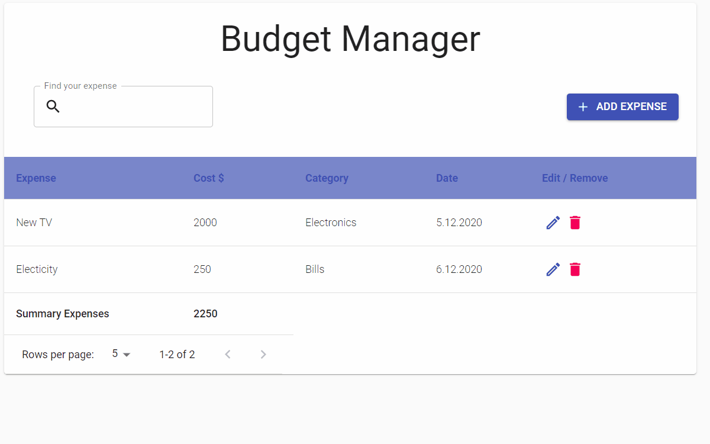
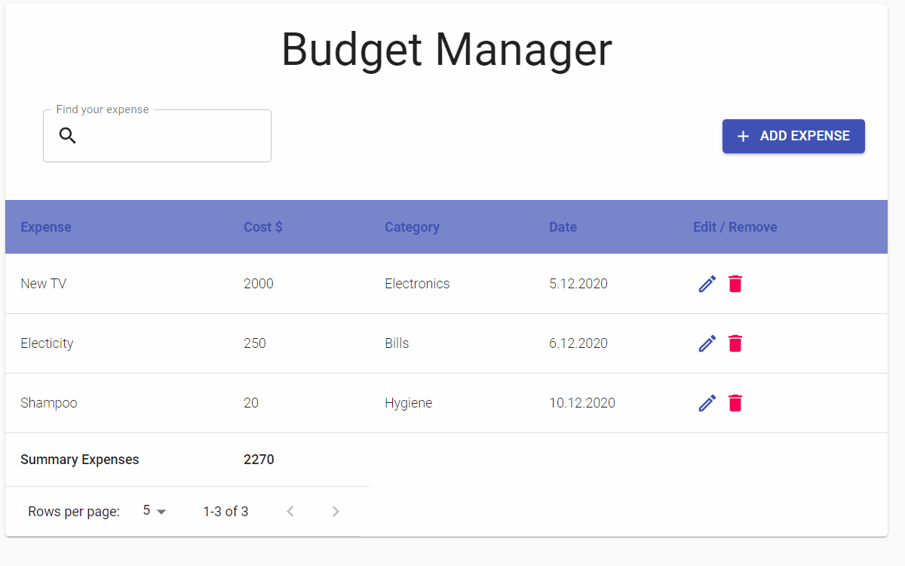
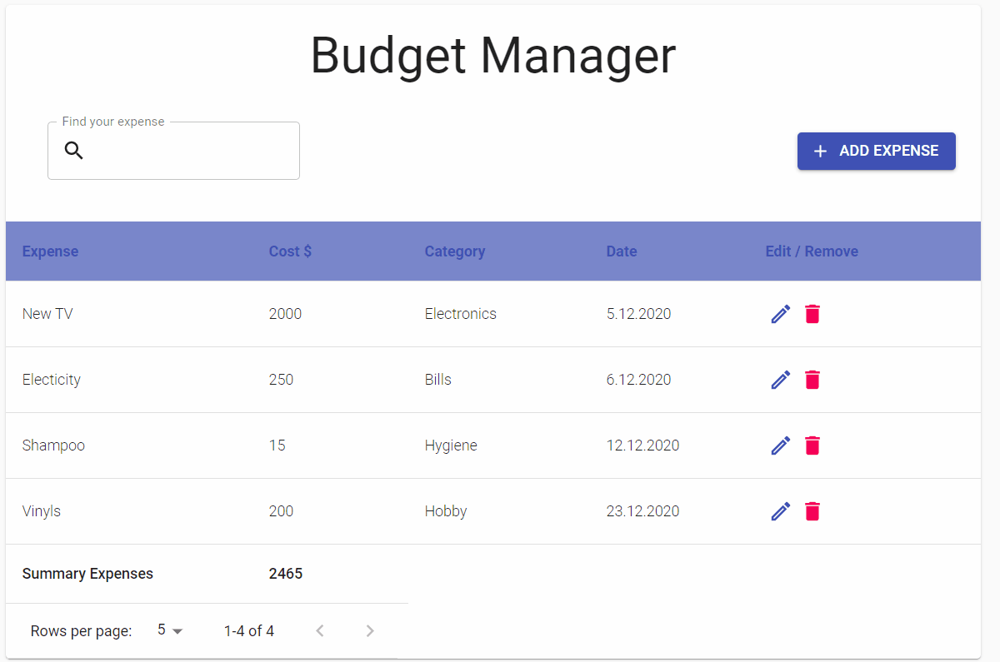
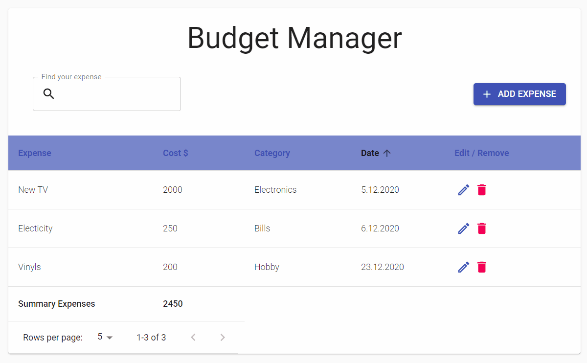

# Budget Manager

This is a simple app which helps You control your home budget. Don't waste your money - manage it.

 

### VERSION HISTORY

1.0.0 - Stable working version introduced

This project was bootstrapped with [Create React App](https://github.com/facebook/create-react-app).

 

# Live Demo

https://mateusz24polok.github.io/budget-manager-app/

 

# Technologies

## Technologies used in project:

 

- HTML &nbsp; 

- CSS &nbsp; 

- TypeScript &nbsp; 

- JavaScript ES6+ &nbsp; 

- React &nbsp; 

- Redux with React-Redux and toolkit &nbsp; 

- Redux Saga &nbsp;  

- Material-UI &nbsp; 

- Formik &nbsp; 

 

# Author and contact

- author: Mateusz Polok
- email: mateusz24polok@gmail.com
- phone: +48535731868

# Instructions how to use

1. Add your expense by clicking "+ ADD EXPENSE" and fill form with expense name, cost, category and data. Finally to add your expense click "ADD" or "RESET" to reset form.

 

 

2. Now You can change your single expense by clicking on the pencil icon. Then You should see form to editing your expense. Change values in form and click "EDIT" to confirm edition or "RESET" to back to the initial values.

 

 

3. You can also remove your expense from list by clicking trash can icon.

 

 

4. You can also sort your expenses. To do this click on one of the table header and sort your expenses list by the value from this table header (ascending or descending - look at the arrow direction).

 

 

5. You can also filter your expenses. To do this write down something in the input search on the left and filter your expenses by the name.

 

 

6. You have also option to change amount of rows display by the table page. To do this change "rows by page" value in the bottom of expenses table.

7. Finally please remember, after close your browser data will be save in cache memory of your browser. So when You come back to your expenses on the same browser, You will start with the same values as you ended before.

 

# Available Scripts

In the project directory, you can run:

### `npm start`

Runs the app in the development mode.\
Open [http://localhost:3000](http://localhost:3000) to view it in the browser.

The page will reload if you make edits.\
You will also see any lint errors in the console.

### `npm run build`

Builds the app for production to the `build` folder.\
It correctly bundles React in production mode and optimizes the build for the best performance.

The build is minified and the filenames include the hashes.\
Your app is ready to be deployed!

See the section about [deployment](https://facebook.github.io/create-react-app/docs/deployment) for more information.

### `npm run eject`

**Note: this is a one-way operation. Once you `eject`, you can’t go back!**

If you aren’t satisfied with the build tool and configuration choices, you can `eject` at any time. This command will remove the single build dependency from your project.

Instead, it will copy all the configuration files and the transitive dependencies (webpack, Babel, ESLint, etc) right into your project so you have full control over them. All of the commands except `eject` will still work, but they will point to the copied scripts so you can tweak them. At this point you’re on your own.

You don’t have to ever use `eject`. The curated feature set is suitable for small and middle deployments, and you shouldn’t feel obligated to use this feature. However we understand that this tool wouldn’t be useful if you couldn’t customize it when you are ready for it.